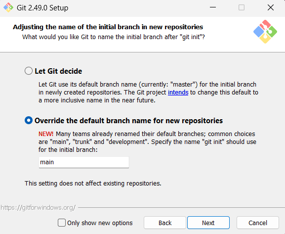

# Git 

**Git es el sistema de control de versiones distribuido open sourse que facilita las actividades colaborativas en el desarrollo de software. Acá hay un resume de los comandos usados en clase.**

**IMPORTANTE**: Si no tienen instalado **_GIT_** en su computadora, deben hacerlo antes de continuar. En el siguiente link pueden descargarlo: [Descargar GIT](https://git-scm.com)

‼️ **Recuerden que para ejecutar los comandos en terminal deben estar bien posicionados en la carpeta en la que van a trabajar.**

‼️**En la pantalla de instalación deberán seleccionar la 2da opción que dice: "Override the default branch name for new repositories" como se ve en la imagen, después de eso se puede dar todo -NEXT- hasta la opción -INSTALL-**

<div align="center">
        
</div>

## Comandos básicos

### 1. Configuración de credenciales.

Les recomendamos que usen el mismo nombre de usuario que tienen en github

```bash
git config --global user.name "userName"
```

Para chequear si el nombre de usuario se ha agregado usamos el comando

```bash
git config user.name
```

La terminal nos deberá devolver el nombre de usuario que hayamos puesto entre comillas.

```bash
|> userName
```

Ahora hacemos los mismos pasos para agregar un email.

```bash
git config --global user.email "user@mail.com"
```

Para chequear si el email se ha agregado correctamente, usamos el comando

```bash
git config user.email
```

La terminal nos deberá devolver el email que hayamos puesto entre comillas.

```bash
|> user@mail.com
```

### 2. Creación de un repositorio

Lo primero que debemos hacer es movernos a la carpeta que sea la de nuestro proyecto. Es importante entender que para ejecutar los comandos en terminal debemos estar bien posicionados en la carpeta en la que vamos a trabajar.

Si el directorio proyecto tiene la siguiente ruta:

```
📁user
|
|___ 📁dev
     |
     |___ 📁programacion3
          |
          |___ 📁proyecto
```

**‼️Debemos posicionarnos en esa carpeta antes de ejecutar cualquier comando**

```bash
cd dev/programacion3/proyecto
```

Una vez dentro del proyecto, debemos realizar los siguientes pasos:

#### 1. Inicializa un repositorio

```bash
git init
```

#### 2. Ahora ejecutaremos el comando **MAS IMPORTANTE**

```bash
git status
```

Este comando nos mostrará por pantalla toda la información del estado del repositorio en un instante de tiempo determinado. Veríamos algo así:

```bash
On branch main

No commits yet

Untracked files:
  (use "git add <file>..." to include in what will be committed)
        index.html <--- (*)

nothing added to commit but untracked files present (use "git add" to track)
```

(\*) Acá apareceran, en rojo, el o los archivos que tengamos en el área de trabajo (WORKING AREA). No significan que estén mal o con un error, solamente indica que no están siendo seguidos por git. En este caso, el archivo index.html no está siendo seguido por git. Esto significa que no se guardará en el repositorio hasta que lo agreguemos.

#### 3. Agregar un archivo al área de preparación (STAGING AREA)

```bash
git add index.html
```

o si queremos agregar todos los archivos:

```bash
git add .
```

una vez ejecutado este comando, veremos que se agrega en la terminal una linea que dice algo así:

```bash
Changes to be committed:
  (use "git rm --cached <file>..." to unstage)
        new file:   index.html
```

Esto significa que el archivo index.html ya está siendo seguido por git. Ahora, veremos que ya no aparece en rojo, sino en verde.

#### 4. Hacer un commit

```bash
git commit -m "Agregando index.html"
```

Esto significa que hemos guardado el archivo en el repositorio. El mensaje que le agregamos entre comillas es una descripción del commit. Es importante agregarle un mensaje que describa lo que hicimos, ya que luego podremos ver el historial de commits y nos ayudará a entender qué hicimos en cada uno.

#### Subir archivos a un repo en github

Una vez que hayamos creado el repo en github y tengamos inicializado el repositorio en local (en nuestra computadora). Debemos vincularlos, para eso ejecutamos el siguiente comando:

```bash
git remote add origin <url-del-repo-en-github>
```

Esto vincula el repositorio local con el remoto. Ahora, para subir los cambios al repo remoto, ejecutamos:

```bash
git push -u origin main
```

Esto sube los cambios al repo remoto. La primera vez que lo hacemos, debemos usar el flag -u para que se vincule la rama local con la remota. Luego, ya no será necesario.

#### 5. Consultar el historial de cambios

```bash
git log
```

Este comando nos muestra todos los commits hechos hasta el momento. Podemos ver el autor, la fecha y el mensaje del commit.

#### 6. Deshacer acciones

Si agregamos un archivo al staging por error y queremos sacarlo:

```bash
git reset index.html
```

Si queremos volver a un commit anterior pero mantener los cambios:

```bash
git reset <id-del-commit>
```

Si queremos volver a un commit anterior y descartar todo:

```bash
git reset --hard <id-del-commit>
```

#### 7. Clonar un repositorio existente

```bash
git clone <url>
```

Esto crea una copia local de un repositorio remoto.

#### 8. Sincronizar cambios

Para traer los cambios desde el remoto sin hacer merge automático:

```bash
git fetch
```

Para traer y fusionar los cambios del remoto:

```bash
git pull
```

Esto trae los cambios del remoto y los fusiona con la rama actual. Si hay conflictos, deberemos resolverlos manualmente.

## Ramas

Crear y moverse a la nueva rama directamente:

```bash
git checkout -b nombre-rama
```

Crear una rama nueva:

```bash
git branch nombre-rama
```

Cambiarse de rama:

```bash
git checkout nombre-rama
```

También podemos usar el siguiente comando para cambiarnos de rama:

```bash
git switch nombre-rama
```

Unir ramas:

```bash
git merge nombre-rama
```

Eliminar una rama:

```bash
git branch -d nombre-rama
```

## Otras herramientas útiles

Ignorar archivos (crear archivo `.gitignore` con patrones como por ejemplo):

```
*.log
node_modules/
dist/
```

## Guardar cambios temporales (stash)

Guardar cambios sin commitear:

```bash
git stash
```

Listar los stashes guardados:

```bash
git stash list
```

Aplicar el último stash guardado:

```bash
git stash pop
```

Eliminar el stash:

```bash
git stash drop
```

---

### 📚 En el siguiente enlace encontrarán un cheat sheet extraido desde github.

**👉[Comandos de git](https://training.github.com/downloads/es_ES/github-git-cheat-sheet.pdf)👈**
